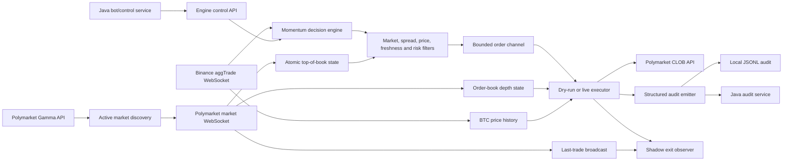
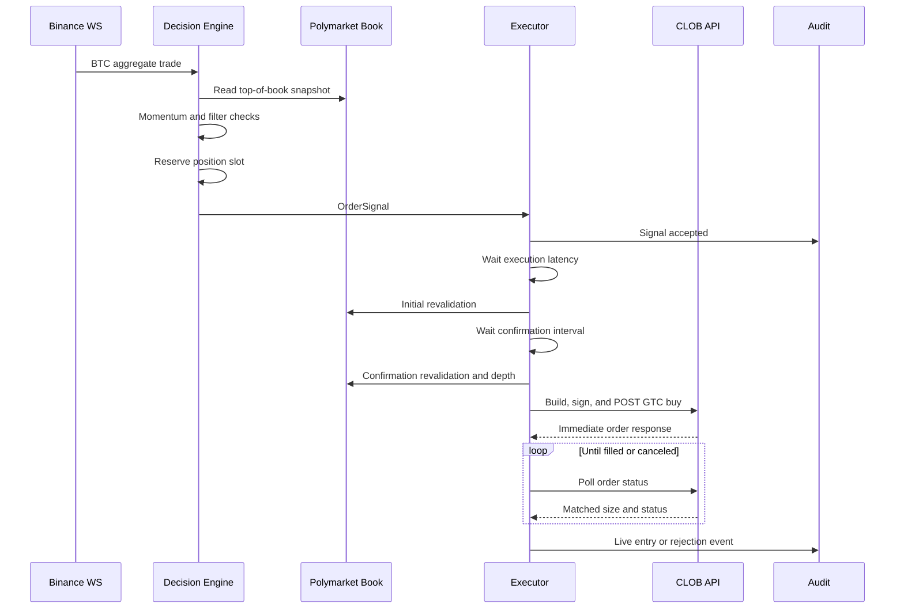
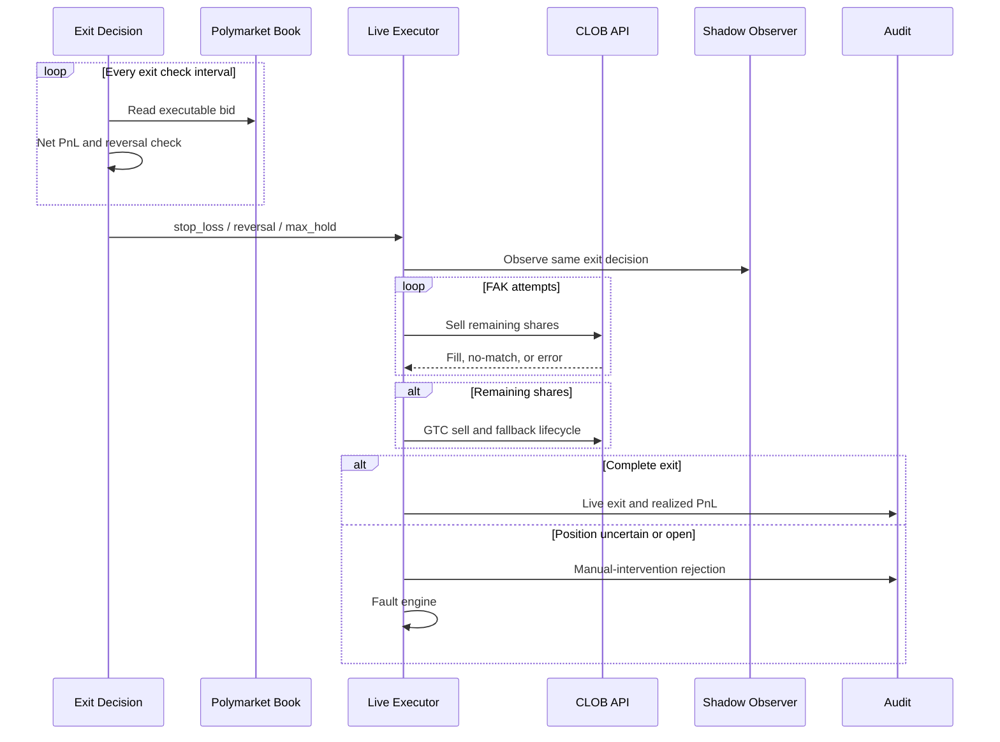

# PolyGo Engine: Technical Case Study and Portfolio Reference

## 1. Document Purpose

This document is a comprehensive technical reference for the PolyGo Engine project. It is intended to support:

- CV and resume bullet extraction
- portfolio case-study writing
- GitHub repository documentation
- technical interview preparation
- architecture reviews
- future code cleanup and modularization

The document describes what the code currently does, why the main design decisions exist, what was learned from live and dry-run operation, and which limitations must be stated honestly.

It is not financial advice, a profitability claim, or a production-readiness certification.

## 2. Project Summary

PolyGo Engine is an asynchronous Rust trading engine built to observe short-duration Bitcoin prediction markets and react to rapid BTC price momentum.

The engine combines:

- Binance BTC/USDT aggregate trade data for signal generation
- Polymarket CLOB WebSocket market data for execution decisions
- Polymarket Gamma API market discovery
- dry-run and live execution modes
- entry confirmation and order-book liquidity checks
- momentum-reversal, stop-loss, and maximum-hold exit decisions
- local and remote structured audit logging
- runtime strategy configuration supplied by a Java control service
- a shadow execution observer for comparing taker and maker-style exits

The system was used with live execution during development. Real trading credentials have since been removed. The code preserves the live path because authenticated order construction, fill handling, cancellation, retry logic, and open-position recovery are central technical parts of the project.

## 3. Portfolio Positioning

The strongest way to present PolyGo is not as a claim that an algorithm consistently made money. Its strongest value is as a real-time systems and trading-infrastructure project that handled imperfect market data, asynchronous execution, exchange errors, partial fills, stale books, and state recovery.

The project demonstrates:

- low-latency asynchronous Rust development
- event-driven architecture
- WebSocket stream processing
- concurrent state coordination
- authenticated exchange API integration
- order lifecycle management
- execution-risk controls
- auditability and observability
- replay-driven strategy development
- practical debugging from live exchange responses

## 4. Scope and Current Status

### Included

- Rust engine source code
- live and dry-run execution logic
- Binance and Polymarket WebSocket integrations
- Gamma API market discovery
- runtime configuration contract
- engine control API
- audit event schema and delivery
- shadow exit comparison logic
- latency and live-connectivity utilities
- unit tests

### Not included in this repository

The broader PolyGo system also contains separate components:

- Java bot/control service
- Java audit service
- Java health and notification services
- frontend dashboard
- PostgreSQL and RabbitMQ infrastructure
- Python market-data collection and replay tooling

Those components communicate with the engine, but this document focuses primarily on `polygo-engine`.

### Current operational posture

- Live execution code remains available.
- Dry-run mode remains available.
- Real credentials are not stored in the repository.
- Example credential values are placeholders.
- The engine should not be presented as currently deployed for real-money trading.
- The code should not be executed against a live exchange without valid credentials, regional eligibility, and explicit operator intent.

## 5. Technology Stack

| Area | Technology | Role |
|---|---|---|
| Language | Rust 2021 | Core engine implementation |
| Async runtime | Tokio | Tasks, channels, timers, TCP control server |
| WebSocket | tokio-tungstenite | Binance and Polymarket streams |
| HTTP | reqwest | Gamma API and remote audit delivery |
| Exchange SDK | polymarket_client_sdk_v2 | CLOB authentication and orders |
| Signing | Alloy | Polygon-compatible local signer |
| Serialization | Serde / serde_json | Config, WebSocket, control, and audit payloads |
| Logging | tracing | Structured runtime diagnostics |
| Configuration | JSON + environment variables | Startup and execution-mode configuration |
| Packaging | Docker multi-stage build | Release binary image |

The release profile enables optimization level 3, link-time optimization, one code-generation unit, symbol stripping, and abort-on-panic behavior.

## 6. Repository Map

| Path | Responsibility |
|---|---|
| `src/main.rs` | Process composition and task startup |
| `src/config.rs` | Startup configuration and validation |
| `src/runtime_config.rs` | Runtime strategy snapshot supplied by Java |
| `src/control.rs` | Engine-local HTTP control API |
| `src/market.rs` | Active five-minute market discovery |
| `src/ws/binance.rs` | Binance aggregate-trade stream |
| `src/ws/polymarket.rs` | Polymarket book, depth, and trade stream |
| `src/engine/strategy.rs` | Momentum signal generation and BTC history |
| `src/engine/decision.rs` | Signal filtering and position reservation |
| `src/engine/state.rs` | Position and realized-PnL state |
| `src/executor/order.rs` | Dry-run and live execution orchestration |
| `src/executor/client.rs` | Authenticated CLOB client construction, signing, and order submission |
| `src/executor/types.rs` | Public order-side and order-signal contracts |
| `src/executor/revalidation.rs` | Entry eligibility and executable-depth checks |
| `src/executor/exit_decision.rs` | Stop-loss, reversal, and maximum-hold exit decisions |
| `src/executor/math.rs` | Sizing, fee coverage, decimal conversion, and fill accounting helpers |
| `src/executor/audit_context.rs` | Order-book and execution context attached to audit events |
| `src/executor/errors.rs` | Exchange error classification |
| `src/executor/rejection.rs` | Reservation release and structured rejection emission |
| `src/emitter/audit.rs` | Structured audit event pipeline |
| `src/shadow.rs` | Alternative exit execution observer |
| `src/health.rs` | Engine health and fault state |
| `src/bin/live_smoke.rs` | Live market connectivity and parse timing utility |
| `src/bin/latency_bench.rs` | Synthetic hot-path latency benchmark |

## 7. High-Level Architecture



## 8. Process Lifecycle

When the binary starts, it performs the following steps:

1. Loads `.env` when available.
2. Loads `config.json`.
3. Applies an execution-mode environment override when configured.
4. Validates market, strategy, risk, control, and shadow settings.
5. Creates the authenticated CLOB client only when startup mode is live.
6. Creates shared engine state.
7. Creates bounded channels for Binance ticks, order signals, and audit events.
8. Starts market discovery, Binance WebSocket, Polymarket WebSocket, decision, executor, and control tasks.
9. Keeps the strategy stopped until runtime configuration is supplied and an explicit start command is accepted.

The process deliberately starts in a stopped state. Data collection tasks may be connected while signal execution remains disabled.

## 9. Configuration Model

PolyGo has two configuration layers.

### 9.1 Startup configuration

Startup configuration defines:

- execution mode
- market discovery endpoint and slug format
- default strategy values
- risk defaults
- audit endpoint
- control bind address
- shadow execution settings

The startup execution mode can be overridden by:

- `POLYGO_ENGINE_EXECUTION_MODE`
- `POLYGO_TRADING_MODE`

Accepted values include dry-run and live spellings defined in the loader.

### 9.2 Runtime strategy configuration

The Java control service sends a versioned strategy payload to the engine.

The runtime payload contains:

- momentum window
- general momentum threshold
- YES threshold
- NO threshold
- intentional execution latency
- cooldown
- exit timing and reversal settings
- entry slippage
- entry confirmation settings
- spread and price boundaries
- market-progress boundaries
- notional and share limits
- realized daily loss limit
- YES/NO outcome mapping

The runtime store uses atomics and a sequence counter to publish coherent snapshots without locking the decision hot path.

The store starts as unconfigured. Startup defaults do not authorize signal generation by themselves. A valid runtime config update must be received first.

### 9.3 Configuration versioning

Each update increments a generation counter and stores a config version string.

Signals retain the generation under which they were accepted. Before execution, the executor rejects a signal if the generation has changed. This prevents an order accepted under one configuration from being executed after an operator changes the strategy.

## 10. Market Discovery

The engine targets fixed-duration BTC markets.

For each interval it:

1. Computes the current interval start from Unix time.
2. Creates a slug such as `btc-updown-5m-{window_start}`.
3. Calls the Gamma event endpoint.
4. Selects an active, open, order-book-enabled market.
5. Maps `UP` or `YES` to the YES token.
6. Maps `DOWN` or `NO` to the NO token.
7. Publishes the active market through a Tokio watch channel.

Token mapping is based on outcome labels rather than token-array position. This avoids assuming that token order is stable.

## 11. Market Time and Progress Controls

`MarketClock` stores active market open and close timestamps in atomics.

The decision and execution paths require the current market progress to remain between configured minimum and maximum values.

This prevents entries:

- before the market has developed enough price information
- too close to settlement
- outside the active interval

## 12. Binance Data Path

The Binance task connects to:

`btcusdt@aggTrade`

Each message provides:

- BTC price
- Binance trade timestamp
- local receive timestamp

The engine distinguishes exchange time from local receive time.

Parsed ticks are sent through a bounded channel with capacity `8192`. The task uses `try_send`; it does not silently drop ticks. Channel saturation faults the engine because a lossy momentum history would make deterministic reasoning impossible.

## 13. Polymarket Data Path

The Polymarket task subscribes to both YES and NO token IDs.

It processes:

- full `book` snapshots
- incremental `price_change` events
- `last_trade_price` events

It also sends a WebSocket `PING` every ten seconds and handles server ping/pong frames.

### 13.1 Top-of-book state

Top-of-book fields are stored as atomic `f64` bit patterns:

- YES bid
- YES ask
- NO bid
- NO ask
- local receive timestamp
- exchange source timestamp

A sequence counter provides a seqlock-style coherent read. Readers retry if an update is in progress.

### 13.2 Depth state

Full bid and ask levels are stored separately under an `RwLock`.

Depth is used to calculate whether enough shares are available at or below an entry limit price.

### 13.3 Last-trade stream

Last-trade events are published to a bounded Tokio broadcast channel with capacity `2048`.

Each trade print contains:

- YES/NO outcome identity
- aggressive side
- trade price
- trade size
- local receive timestamp
- source timestamp

The shadow execution observer uses this stream to estimate whether maker queue volume would have been consumed.

## 14. Momentum Strategy

The strategy maintains a bounded deque of recent BTC ticks.

For each tick:

1. It computes a cutoff using Binance trade timestamps.
2. It removes data older than the configured momentum window.
3. It requires a baseline that reaches the entire requested window.
4. It computes `latest_price - baseline_price`.
5. Positive momentum maps to `BUY_YES`.
6. Negative momentum maps to `BUY_NO`.
7. The absolute move must exceed the effective threshold.

The effective threshold is:

`max(general_threshold, side_specific_threshold)`

This means the general threshold acts as a global floor while YES and NO can remain asymmetric.

## 15. Signal Filter Chain

A momentum candidate is not automatically an order.

The decision engine checks, in order:

1. Runtime configuration exists.
2. Binance processing delay is within the freshness budget.
3. Signal cooldown has expired.
4. Engine state is running.
5. Market data is ready.
6. Market progress is allowed.
7. Book data is fresh.
8. Selected outcome has both bid and ask.
9. Ask is above bid.
10. Spread is within the configured maximum.
11. Ask is within the configured price range.
12. No position or reservation is active.
13. Realized daily net loss has not reached the limit.
14. The order channel can accept the signal.

Rejected candidates are rate-limited in diagnostic logs to avoid flooding the hot path.

## 16. Position Reservation

Before a signal enters the order channel, `EngineState` atomically reserves the position slot.

The reservation closes the race between signal acceptance and asynchronous order execution.

Current behavior enforces one active or reserved position at a time, even though a configurable `max_open_positions` value exists. For portfolio accuracy, this should be described as a single-position invariant in the current implementation.

The state tracks:

- active or reserved count
- reservation timestamp
- current position ID
- next position ID
- UTC-day realized net PnL
- total process PnL
- total trades

## 17. Daily Loss Control

The daily loss gate uses realized net PnL rather than summing only losing trades.

Behavior:

- gains offset losses during the same UTC day
- the gate blocks new reservations when daily net PnL is less than or equal to the negative limit
- the in-memory daily value resets when a new UTC day is observed
- changing the limit applies to the already accumulated PnL

The value is process-local. It is not restored from an exchange account or database after restart.

## 18. Order Sizing

Entry size is calculated from the current ask:

`floor(max_notional_usd / ask)`

The result is capped by `max_shares`.

The current entry path uses integer share intent. Live fills can be fractional.

The engine also checks whether the configured expected price move can cover estimated entry and exit fees before accepting an entry.

## 19. Fee Model

The internal fee estimate is:

`shares * 0.07 * price * (1 - price)`

PnL is rounded to five decimal places.

This model is used for:

- dry-run entry/exit accounting
- live realized-PnL audit calculation
- exit stop-loss and profitability marks
- shadow policy comparison

It is an execution model, not a guarantee that every future exchange fee schedule or maker incentive is identical.

## 20. Dry-Run Execution

Dry-run uses the same signal scheduling and entry revalidation path as live mode, but it does not submit exchange orders.

The dry-run path:

1. Waits until the signal's scheduled execution time.
2. Confirms the engine is still running.
3. Confirms the configuration generation is unchanged.
4. Revalidates market progress, book freshness, spread, price, size, and fee coverage.
5. Opens a simulated position at the current ask.
6. Waits for an exit decision.
7. Exits at the current selected bid.
8. Calculates fees and net PnL.
9. Emits entry and exit audit events.

Dry-run is useful for system validation, but it does not reproduce exchange queue priority, API latency, authentication overhead, rejection behavior, or actual fill uncertainty.

## 21. Live Entry Lifecycle

Live entry is deliberately more restrictive than dry-run.

### 21.1 Initial revalidation

After the configured execution delay, the executor rechecks:

- engine running state
- configuration generation
- market progress
- book freshness
- spread
- price range
- expected fee coverage

It records the selected bid before confirmation.

### 21.2 Entry confirmation

The executor waits for `entry_confirmation_ms` and performs a second complete revalidation.

It then requires:

`confirmed_bid >= initial_bid + min_entry_bid_improvement`

This is intended to avoid entering solely on a transient Binance move when the prediction-market bid does not confirm the direction.

### 21.3 Exchange minimum and depth

The engine rejects entries below `min_exchange_shares`.

It calculates a buy limit:

`min(ask + entry_slippage, 0.95)`

It sums ask depth at prices less than or equal to that limit.

Available shares must cover:

`intended_shares * 1.25`

The multiplier provides a buffer against depth disappearing before the order reaches the exchange.

### 21.4 GTC entry order

Live entry uses a marketable GTC limit buy rather than an FAK buy.

The engine measures:

- order build latency
- signature latency
- POST latency
- total submission latency

After submission it:

1. Records immediate fill amounts from the POST response.
2. Polls order status.
3. Uses a shorter poll count when a `LIVE` response reports zero making and taking amounts.
4. Accumulates later matched shares without overwriting earlier execution notional.
5. Cancels an incompletely filled order.
6. Fetches final status after cancellation.
7. Marks the result pending when cancellation cannot be confirmed.

A zero fill becomes `live_entry_zero_fill` or `live_entry_gtc_pending` depending on exchange state.

## 22. Partial Entry and Pending-Order Safety

If a live order partially fills, the engine manages the filled quantity as a position.

If an unconfirmed buy order may still remain open, the engine faults itself because the position could continue increasing outside the known state.

This is intentionally conservative. It prefers operator intervention over pretending the exchange state is fully known.

## 23. Exit Decision Strategy

The current exit strategy combines PnL state and short-window BTC momentum.

The engine checks exits at `exit_check_interval_ms`.

### 23.1 Mark-to-book calculation

The position is marked against the current executable bid for the selected outcome.

The mark includes:

- gross PnL
- estimated entry fee
- estimated exit fee
- net PnL
- net PnL percentage over entry notional

Stale books do not produce a valid mark.

### 23.2 Stop loss

Stop loss is percentage-based and can trigger before minimum hold time.

This gives loss control priority over reversal timing.

### 23.3 Momentum reversal

After `exit_min_hold_ms`, the engine checks recent BTC momentum over `exit_reversal_window_ms`.

Adverse reversal rules:

- `BUY_YES`: exit when BTC momentum is less than or equal to the negative reversal threshold
- `BUY_NO`: exit when BTC momentum is greater than or equal to the positive reversal threshold

If the current marked net PnL is at least the take-profit threshold, the reason is `profit_reversal`.

Otherwise the reason is `momentum_reversal`.

### 23.4 Maximum hold

If no earlier condition triggers, the engine exits at `exit_max_hold_ms`.

## 24. Live Exit Lifecycle

Live exit prioritizes getting out of an actual position rather than merely producing a clean local state transition.

### 24.1 Pre-exit checks

Before submitting a sell order, the engine verifies:

- current book freshness
- selected bid availability
- sellable quantity after flooring to two decimals

If any check fails, the position remains open, the engine faults, and an audit event requests manual intervention.

### 24.2 FAK sell attempts

The executor first tries FAK market sells.

It supports:

- partial fills
- repeated attempts for remaining shares
- no-match error recognition
- balance/allowance settlement recognition
- bounded balance retry delays of 250, 500, 1000, and 2000 ms
- up to 40 FAK attempts

No-match errors are retried. Unknown errors stop the FAK loop.

### 24.3 GTC fallback

If FAK does not sell the complete position, the engine uses GTC fallback orders.

The fallback:

- uses the current bid for normal attempts
- polls order status
- cancels before repricing
- confirms cancellation and final fill state
- performs bounded repricing attempts
- finally places a floor-price order at `0.01`
- allows a long final polling period for position recovery

If the fallback is still incomplete or pending, the engine keeps the local position open and enters a faulted state.

### 24.4 Realized live PnL

The engine calculates exit VWAP from actual observed proceeds divided by sold shares.

It then records:

- entry price
- exit price
- filled shares
- gross PnL
- entry fee
- exit fee
- net PnL
- exit reason
- hold duration
- exit momentum

## 25. Exchange Error Taxonomy

Examples of explicit execution outcomes include:

- `entry_revalidation`
- `entry_confirmation_revalidation`
- `entry_confirmation`
- `entry_below_exchange_min_size`
- `insufficient_entry_depth`
- `live_entry_zero_fill`
- `live_entry_gtc_pending`
- `live_exit_stale_book_position_open`
- `live_exit_missing_bid_position_open`
- `live_exit_unsellable_amount_position_open`
- `manual_exit_required_balance_unavailable`
- `live_exit_gtc_pending_position_open`
- `live_exit_gtc_failed_position_open`
- `live_exit_zero_fill_position_open`

This taxonomy was developed from real execution failures rather than only synthetic happy-path design.

## 26. Shadow Exit Observer

The shadow observer compares alternative execution policies without submitting additional real orders.

The config explicitly rejects `shadow_submit_real_orders = true`.

### 26.1 Policies

The observer produces:

- same-latency taker baseline
- Policy E: maker attempt for profitable reversals
- Policy D: maker attempt for both momentum and profitable reversals

All three policies run concurrently against the same future market period.

### 26.2 Maker activation

The shadow maker price is:

`best_bid + one tick`

If this price crosses the best ask, the simulated post-only order is rejected and the policy falls back to taker execution.

### 26.3 Queue model

At maker activation, the observer calculates ask-side queue ahead at or below the limit price.

It consumes subsequent aggressive BUY trade volume at or above the maker price.

A maker fill is recognized only after observed trade volume exceeds queue ahead.

Possible outcomes include:

- full trade-supported maker fill
- partial trade-supported maker fill plus fallback
- zero-fill timeout plus fallback
- post-only rejection
- taker bypass because queue ratio is too high
- insufficient future data

### 26.4 Comparison output

The audit record includes:

- policy timelines
- queue snapshot and ratio
- maker and fallback shares
- maker and fallback VWAP
- PnL decomposition
- baseline/policy sign comparison
- incremental PnL difference
- completion latency

This is an execution-quality experiment. It does not claim exact exchange queue priority because only public market events are available.

## 27. Audit Architecture

Audit events are first placed into a bounded in-process channel.

The dispatcher creates a common envelope containing:

- schema version
- source
- engine session ID
- execution mode
- emission timestamp
- runtime config version
- event payload

Each serialized event is sent to:

- a local JSONL writer
- an optional Java audit endpoint

### 27.1 Local audit behavior

Local audit delivery is treated as mandatory.

Serialization failure, queue saturation, file-open failure, or file-write failure faults the engine.

### 27.2 Remote audit behavior

The Java audit worker uses a reused HTTP client with a 500 ms timeout.

Remote queue saturation or delivery failure is logged. It does not block the trading hot path.

### 27.3 Audit context

Execution audit context can include:

- market slug
- token ID
- YES and NO bid/ask
- local book receive time
- exchange source time
- local book age
- selected bid/ask
- entry slippage
- entry limit
- intended shares and notional
- available and required depth
- exchange error
- filled shares
- retry attempts
- funder address and signature type
- build/sign/POST latency
- GTC poll, cancellation, and final status fields

This level of context makes exchange failures explainable after the fact.

## 28. Health and Fault Model

The engine has three top-level states:

- stopped
- running
- faulted

Known fault categories include:

- audit backpressure
- Binance backpressure
- execution backpressure
- open position requiring manual intervention

Starting requires:

- market readiness
- healthy local audit pipeline
- a non-faulted process
- a matching runtime config version
- a requested execution mode matching the process startup mode

A faulted process cannot simply be restarted through the control endpoint. This avoids clearing uncertainty without rebuilding state.

## 29. Control API

The engine exposes a minimal HTTP/1.1 server implemented directly with Tokio TCP primitives.

Endpoints:

| Method | Path | Purpose |
|---|---|---|
| `GET` | `/v1/health` | Engine status and config version |
| `PUT` | `/v1/config` | Validate and replace runtime strategy |
| `POST` | `/v1/control/start` | Start signal execution |
| `POST` | `/v1/control/stop` | Stop signal execution |

The parser limits requests to 16 KiB and rejects malformed JSON or unknown routes.

In Docker Compose, engine port `8090` is bound to host loopback. Other services access it through the internal Docker network.

The engine endpoint itself does not implement an authentication token. Network exposure must therefore remain restricted.

## 30. Concurrency Model

PolyGo uses different coordination primitives for different data shapes.

| Primitive | Use |
|---|---|
| Tokio task | Independent network and processing loops |
| Bounded MPSC | Binance ticks, order signals, audit events |
| Watch channel | Current active market |
| Broadcast channel | Last-trade stream for shadow policies |
| Atomics | Health, top-of-book, config scalars, position counters |
| Sequence counter | Coherent lock-free-style snapshots |
| `RwLock` | Full order-book depth and config version string |
| `Mutex<VecDeque>` | Shared bounded BTC history |

The decision path avoids network requests and disk I/O.

Exchange HTTP requests occur only in live execution tasks.

## 31. Backpressure Philosophy

The engine does not silently continue after losing critical events.

Examples:

- Binance channel full: engine fault
- execution channel full: reservation release plus engine fault
- audit channel full: engine fault
- remote audit delivery full: warning and remote drop

This distinguishes critical deterministic state from optional external observability.

## 32. HTTP Client Reuse

HTTP clients are long-lived and reused.

- Gamma market discovery creates one client for its loop.
- Java audit delivery creates one client for its worker.
- The authenticated Polymarket SDK client is created once for live mode and cloned through shared internal state.

The engine does not create a new `reqwest::Client` for every order.

## 33. Latency Instrumentation

The live order path measures:

- GTC order build time
- signature time
- POST time
- total submission time
- status request time
- cancellation time
- final status request time
- FAK sell request time

The audit payload preserves entry latency fields for historical analysis.

`latency_bench` measures:

- Binance JSON parsing
- Polymarket typed parsing
- atomic book updates
- momentum decisions
- execution revalidation
- audit queue insertion
- synthetic end-to-end hot path
- bounded channel throughput and overload detection

`live_smoke` measures live parse CPU time and exchange timestamp difference without placing orders.

## 34. Reliability Decisions Learned from Live Use

### 34.1 FAK no-match is normal exchange behavior

Visible book liquidity can disappear before an order reaches the exchange. A fresh local book does not guarantee a FAK match.

The engine therefore treats specific no-match errors as retryable rather than as impossible states.

### 34.2 Partial fills must create real positions

An order can fail to fill completely while still creating exposure. The engine tracks the actual filled quantity instead of treating partial execution as a total rejection.

### 34.3 Entry and exit have different failure costs

A failed entry can release its reservation when no shares were acquired.

A failed exit cannot release local position state because real shares may remain in the account.

### 34.4 Exchange state can lag balance state

Immediately after a buy, sellable balance or allowance may not yet be visible. The live exit path includes bounded settlement retries.

### 34.5 Execution quality can dominate signal quality

Historical debugging showed that zero fills, pending GTC orders, submission latency, adverse selection, spread, and fees can dominate strategy-level expectations.

This is why the audit model records execution detail rather than only signal direction and final PnL.

## 35. Test Coverage

The current Rust test suite covers:

- coherent atomic book snapshots
- YES/NO token mapping
- last-trade publication for shadow fill tracking
- market progress boundaries
- momentum direction
- full-window requirement
- global threshold behavior
- shared recent-momentum direction
- fee and PnL rounding
- single-position reservation
- runtime daily-loss limit updates
- net realized daily PnL behavior
- runtime config snapshot coherence
- control API behavior
- config update stopping the engine
- order sizing limits

At the time of this document update:

- 17 Rust unit tests passed
- `cargo check` passed
- `cargo fmt --check` passed

This does not replace live exchange integration tests.

## 36. Known Limitations

These limitations should remain visible in a portfolio presentation.

### 36.1 Remaining live-lifecycle concentration

The first behavior-preserving executor refactor has been completed. The original `src/executor/order.rs` was reduced from 1,865 lines to 1,212 lines while retaining the existing public import paths.

The following responsibilities now have dedicated modules:

- authenticated CLOB client construction and order submission
- public order signal types
- sizing, decimal, fee-coverage, and fill helpers
- entry revalidation and depth checks
- exit-decision calculation
- exchange error classification
- audit context construction
- rejection and reservation-release handling

The remaining `order.rs` still owns both the live entry lifecycle and the live exit lifecycle. These flows are intentionally unchanged but remain large enough to justify a second extraction into dedicated `live/entry.rs` and `live/exit.rs` modules.

### 36.2 One-position invariant versus config name

The state currently enforces one active position even if `max_open_positions` is greater than one. Either the field should be removed or true multi-position ownership should be implemented.

### 36.3 Process-local risk state

Daily and total PnL are not restored after process restart. Production-grade recovery would require reconciliation with persistent audit state and exchange balances.

### 36.4 Poll-based user order state

The engine polls REST order status. An authenticated user WebSocket could reduce latency and improve fill-state authority.

### 36.5 Book/depth coherence

Top-of-book and full depth are stored separately. They can represent adjacent, rather than identical, WebSocket revisions.

### 36.6 Shared book freshness

The snapshot uses one receive timestamp for both outcomes. A more rigorous implementation would track freshness independently for YES and NO.

### 36.7 Spawned execution-task supervision

Per-signal execution tasks are spawned independently. A panic inside one task is not joined by the top-level process supervisor.

### 36.8 Shadow queue approximation

Public last-trade events cannot prove exact private queue position. The shadow observer is conservative research instrumentation, not an authoritative fill simulator.

### 36.9 Fee assumptions

The fee model may not capture every future exchange fee, rebate, or account-specific condition.

### 36.10 Local control authentication

The engine control API trusts network isolation. A production multi-host deployment should add authenticated requests or mutual TLS.

### 36.11 Secrets and example values

Real credentials are removed. Placeholder passwords and tokens in example infrastructure must remain clearly labeled as non-production values.

## 37. Executor Refactoring Status and Next Steps

The live path remains present and directly usable when valid credentials and live startup configuration are supplied. It has not been hidden behind a compile-time feature or replaced with a simulation-only implementation.

### 37.1 Completed behavior-preserving split

Current executor structure:

```text
src/executor/
  mod.rs
  audit_context.rs
  client.rs
  errors.rs
  exit_decision.rs
  math.rs
  order.rs
  rejection.rs
  revalidation.rs
  types.rs
```

Compatibility and performance constraints maintained by this refactor:

- `executor::order::{LiveExecutor, OrderSide, OrderSignal, revalidate_entry}` remains valid.
- No lock, network request, allocation, or blocking operation was added to the hot path.
- CLOB authentication still occurs once during startup, and the authenticated SDK client remains reused across orders.
- Entry, exit, partial-fill, retry, cancellation, audit, and fault behavior remains unchanged.
- Pure sizing and error-classification logic now has focused unit-test ownership.

### 37.2 Next executor split

The next planned module boundary is:

```text
src/executor/
  live/
    mod.rs
    entry.rs
    exit.rs
    fills.rs
  dry_run.rs
```

This second split should move lifecycle orchestration without changing exchange behavior. The live entry module should own confirmation, depth validation, GTC submission, polling, cancellation verification, and position opening. The live exit module should own FAK attempts, balance-settlement retries, GTC fallback, incomplete-exit fault handling, and realized-PnL closure.

### 37.3 Broader engineering improvements

1. Add integration tests with mocked CLOB responses.
2. Add explicit position state-machine types.
3. Add authenticated user WebSocket order updates.
4. Persist risk state and reconcile on startup.
5. Track per-outcome book timestamps.
6. Add task supervision for spawned execution jobs.
7. Add GitHub Actions for format, check, and test.
8. Add sanitized example audit payloads.
9. Add a deterministic dry-run demonstration fixture.
10. Add architecture and sequence diagrams to the main README.

## 38. Suggested Entry Sequence Diagram



## 39. Suggested Exit Sequence Diagram



## 40. CV Bullet Candidates - Turkish

Use only bullets that match the target position and that can be defended in an interview.

### Backend / Rust

- Rust ve Tokio kullanarak Binance ve Polymarket gerçek zamanlı veri akışlarını işleyen asenkron bir trading engine geliştirdim.
- Atomik snapshot, bounded channel ve backpressure kontrolleriyle düşük gecikmeli, event-driven bir piyasa veri hattı tasarladım.
- Polymarket CLOB için authenticated emir oluşturma, imzalama, GTC/FAK lifecycle, partial fill, cancel ve retry süreçlerini uyguladım.
- Canlı ve dry-run execution modlarını ortak revalidation, risk ve audit katmanları üzerinden yöneten bir Rust mimarisi geliştirdim.
- Runtime strategy config güncellemelerini lock-free-style sequence snapshot yaklaşımıyla hot path'e taşıdım.

### Trading Systems

- Momentum sinyallerini spread, fiyat, market progress, order-book freshness, depth ve fee-coverage kontrolleriyle filtreleyen execution pipeline geliştirdim.
- Stop-loss, momentum reversal, profit reversal ve max-hold kararlarını gerçek executable bid ve fee-adjusted PnL üzerinden hesapladım.
- Exchange kaynaklı zero-fill, partial-fill, pending order, stale book ve balance-settlement durumları için açık hata sınıflandırması ve recovery akışları oluşturdum.
- Maker ve taker exit politikalarını aynı piyasa zaman çizgisinde karşılaştıran, trade-supported queue tüketim modeli geliştirdim.

### Reliability / Observability

- Her sinyal ve emri order-book context, latency, fill, retry ve exchange response alanlarıyla izlenebilir hale getiren structured audit sistemi geliştirdim.
- Kritik market-data veya audit kaybında sessiz devam etmek yerine engine'i fault durumuna alan bounded backpressure yaklaşımı uyguladım.
- Giriş, imzalama, HTTP POST, polling ve cancellation aşamalarını ayrı ayrı ölçen latency telemetry ekledim.
- 17 unit test ve sentetik latency benchmarklarıyla strateji, state, config, control ve market-data bileşenlerini doğruladım.

### Full-System

- Rust engine, Java kontrol/audit servisleri, frontend dashboard, PostgreSQL, RabbitMQ ve Docker Compose bileşenlerinden oluşan çok servisli trading sistemi geliştirdim.
- Canlı piyasa ve execution hatalarını audit kayıtları üzerinden analiz ederek strateji parametreleri ile execution-quality problemlerini birbirinden ayırdım.

## 41. CV Bullet Candidates - English

Recommended concise version:

**PolyGo Engine - Solo Developer**

- Built an asynchronous Rust trading engine with Tokio that processes real-time Binance BTC trades and Polymarket five-minute binary-market order books using bounded channels and atomic snapshots.
- Implemented authenticated Polymarket order signing and GTC/FAK execution workflows, including partial-fill accounting, cancellation verification, retry handling, and fallback exit orders.
- Developed a momentum-based execution pipeline with spread, price, freshness, depth, fee-coverage, and market-progress filters. Exit decisions use executable bid prices for stop-loss, momentum-reversal, and maximum-hold rules.
- Added structured audit logging, execution-latency instrumentation, and fault-state handling for latency-sensitive paths, tested with unit tests and benchmark harnesses.

Optional interview details that should not be added to every CV bullet:

- versioned runtime configuration shared between Java control services and the Rust hot path
- explicit single-position reservation before asynchronous execution
- UTC-day net realized-PnL risk accounting
- zero-fill, pending-order, stale-book, and balance-settlement failure classification
- trade-supported shadow execution for maker-versus-taker exit comparison
- per-stage build, sign, POST, polling, and cancellation latency fields

## 42. Short Portfolio Description - Turkish

PolyGo, Binance BTC fiyat hareketlerini Polymarket'in beş dakikalık prediction market order book'u ile birleştiren event-driven bir Rust trading engine'idir. Sistem; WebSocket veri işleme, momentum sinyali, order-book revalidation, GTC/FAK emir lifecycle, partial fill ve retry yönetimi, fee-adjusted exit kararları, runtime config ve structured audit katmanlarını içerir. Proje canlı piyasa koşullarında test edilmiş, ardından gerçek credential'lar kaldırılarak teknik portfolio projesi olarak korunmuştur.

## 43. Short Portfolio Description - English

PolyGo is an event-driven Rust trading engine that combines Binance BTC price momentum with five-minute Polymarket prediction-market order books. It includes WebSocket market-data processing, order-book revalidation, authenticated GTC/FAK order lifecycles, partial-fill and retry handling, fee-adjusted exits, runtime configuration, and structured audit telemetry. The system was exercised under live market conditions and is now maintained as a credential-free technical portfolio project.

## 44. Interview Talking Points

### Why Rust?

Rust provides predictable performance, memory safety, explicit ownership, and strong concurrency primitives. Tokio supports independent network loops and bounded channels without requiring a thread per connection.

### Why bounded channels?

Unbounded queues hide overload by increasing memory and latency. In market-data processing, old queued events can be worse than an explicit fault because decisions may be made from delayed state.

### Why reserve before spawning execution?

Signal generation and order execution are asynchronous. Reserving atomically before queueing prevents multiple ticks from opening concurrent positions during execution latency.

### Why use receive timestamps?

Exchange timestamps describe source event time. Local receive timestamps are needed to determine whether the engine's current state is fresh enough for a local execution decision.

### Why did visible liquidity still produce no-match errors?

The order book can change between WebSocket receipt and authenticated HTTP order arrival. FAK orders depend on liquidity still existing when matched by the exchange.

### Why use GTC for entry?

GTC permits controlled marketable limit behavior, explicit fill polling, cancellation, and partial-fill accounting instead of treating every missing immediate match as a total failure.

### Why is a failed exit different from a failed entry?

A failed entry with zero fill creates no exposure. A failed exit can leave real shares open, so local state must remain reserved and the engine should fault for manual recovery.

### Why is the shadow observer useful?

It separates exit-decision quality from exit-execution quality. The same exit decision can be evaluated under a taker baseline and maker alternatives without sending duplicate live orders.

### What would be redesigned next?

The first executor modularization stage is complete. The next changes would separate live entry and exit lifecycles, then add authenticated user order updates, persistent risk recovery, per-outcome freshness, execution-task supervision, and mocked exchange integration tests.

## 45. Honest Claims and Claims to Avoid

### Defensible claims

- The engine processed live market data.
- The project contains a real authenticated live execution path.
- The system encountered and handled real exchange rejection and fill behaviors.
- The code includes partial-fill, retry, cancellation, and fallback logic.
- The project has structured audit context and latency telemetry.
- The engine supports both dry-run and live modes.

### Claims to avoid

- Guaranteed profitability
- High-frequency trading at institutional scale
- Exact exchange queue simulation
- Fully production-ready account reconciliation
- Complete protection against every exchange or network failure
- Current real-money deployment
- Regulatory or regional eligibility

## 46. Evidence Checklist for Portfolio Publication

Before publishing the repository publicly:

- [ ] Confirm `.env` is ignored and absent from Git history.
- [ ] Confirm all passwords, tokens, wallet addresses, and API credentials are placeholders.
- [ ] Inspect staged files before every commit.
- [ ] Exclude raw market data and generated analysis artifacts.
- [ ] Add a root README linked to this case study.
- [ ] Add architecture images or rendered Mermaid diagrams.
- [ ] Add a sanitized sample audit event.
- [ ] Add CI for format, check, and tests.
- [ ] State that live execution requires operator-supplied credentials and eligibility.
- [ ] State that historical tests do not guarantee future performance.
- [ ] Avoid publishing account-specific funder addresses from old audit files.
- [ ] Remove local `audit_log.jsonl` from publication.

## 47. Final Assessment

PolyGo is technically valuable because it goes beyond signal generation. It covers the difficult boundary between a strategy idea and an exchange-integrated system:

- asynchronous market data
- stale-state detection
- order-book liquidity
- authenticated signing
- partial and pending fills
- retries and cancellation
- position ownership
- fee-adjusted exits
- operator control
- auditability
- fault handling

The strongest portfolio narrative is therefore:

> I built and debugged an event-driven Rust trading engine under real market and exchange constraints, then converted the system into an auditable, credential-free technical case study.

That statement is technically accurate and does not depend on making an unsupported profitability claim.
