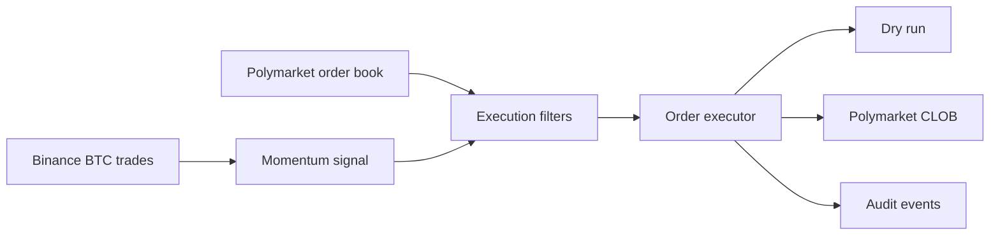

# PolyGo Engine

PolyGo Engine is an asynchronous Rust trading engine for five-minute Bitcoin prediction markets. It combines real-time BTC trades from Binance with Polymarket order-book data to generate, validate, and execute short-term momentum signals.

The repository contains both dry-run and authenticated live execution paths. Real credentials are not included.

## How It Works



1. The engine discovers the active five-minute BTC market through the Polymarket Gamma API.
2. Binance aggregate trades are stored in a short rolling price history.
3. A positive BTC move can produce a `BUY_YES` candidate; a negative move can produce a `BUY_NO` candidate.
4. The candidate is checked against market progress, spread, price range, book freshness, available depth, fee coverage, position state, and daily loss limits.
5. After a confirmation interval, the engine revalidates the order book before execution.
6. The executor either simulates the trade or submits authenticated orders to the Polymarket CLOB.
7. Open positions are evaluated using executable bid prices and can exit on stop-loss, adverse momentum reversal, or maximum hold time.

## Execution Model

- **Dry run:** Simulates entries and exits using current order-book prices and the same strategy checks used by the live path.
- **Live:** Builds and signs authenticated Polymarket orders. The order workflow handles GTC entry orders, partial fills, status polling, cancellation verification, FAK exit attempts, retries, and GTC fallback exits.
- **Audit:** Emits structured events for signals, rejections, fills, retries, exchange errors, order-book context, and execution latency.
- **Shadow exits:** Compares the selected exit with alternative maker-style execution without submitting additional real orders.

## Strategy Summary

The strategy measures the signed BTC price change over a configurable momentum window. Direction-specific thresholds decide whether the candidate is `BUY_YES` or `BUY_NO`.

Before an order is accepted, the engine applies:

- momentum and direction thresholds
- market progress limits
- minimum and maximum entry prices
- maximum spread and book age
- expected move versus estimated fees
- executable order-book depth
- single-position reservation
- daily realized-loss limit

Exit decisions use fee-adjusted PnL calculated from the executable bid rather than a chart or midpoint price.

## Technology Stack

| Area | Technology |
|---|---|
| Language | Rust 2021 |
| Async runtime | Tokio |
| WebSockets | tokio-tungstenite |
| HTTP | reqwest |
| Serialization | Serde / serde_json |
| Exchange integration | polymarket_client_sdk_v2 |
| Signing | Alloy |
| Logging | tracing |
| Packaging | Docker |

The engine uses bounded Tokio channels for backpressure and atomic snapshots for low-overhead access to current market state.

## Project Structure

```text
src/
  engine/       signal generation, filters, and position state
  executor/     dry-run and live order workflows
  emitter/      structured audit delivery
  ws/           Binance and Polymarket WebSocket clients
  control.rs    local runtime control API
  market.rs     active market discovery and market clock
  shadow.rs     alternative exit evaluation
```

## Configuration

Strategy and risk settings are loaded from `config.json`. The execution mode can be selected with:

```bash
POLYGO_ENGINE_EXECUTION_MODE=dry_run
```

Live execution additionally requires valid Polymarket credentials. See `.env.example` for the supported variables. The engine starts in a stopped state and requires an explicit control command before processing orders.

## Verification

```bash
cargo test
cargo check
cargo fmt --check
```

The repository also includes `latency_bench` for synthetic hot-path measurements and `live_smoke` for market connectivity diagnostics.

## Scope

This repository contains the Rust engine. The broader PolyGo project also used separate Java control and audit services, PostgreSQL, RabbitMQ, a frontend dashboard, and Python replay tooling.

For a detailed architecture and engineering case study, see [PORTFOLIO_TECHNICAL_CASE_STUDY.md](PORTFOLIO_TECHNICAL_CASE_STUDY.md).

This project is presented as a trading-systems engineering case study, not as a profitability claim or financial advice.
